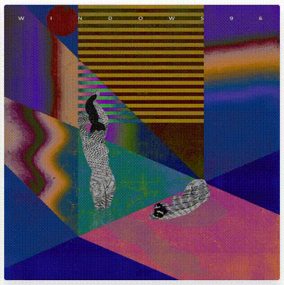

## Phrase

Phrase is a decentralized registry and fan-funding system for digital content, built on Ethereum and content-addressable networks like IPFS. There's a prototype app built with React.

Phrase allows content creators to register digital content along with the metadata required to view, listen to, or otherwise experience the content, and make the content available to others via a content-addressable network (IPFS). Users can then interact with the content, and express their appreciation via a novel funding scheme.

_Why 'phrase'? A 'phrase' is a collection of words, symbols, or patterns that form a unit with some greater meaning. There are phrases in virtually every type of expression, like speech, music, or visuals. Use of the term here is an extension of this concept to files and other digital artifacts._

### Overview

A phrase is a discrete unit of digital content, like an album, a painting, or a zine. The root address of the content and its format are stored in a registry contract. This means that you can view the content by referencing the phrase's key.

In React, a phrase can be rendered like so:
```html
<Phrase _key="ABC...123" />
```



_In this case, it's an [album](https://windows96.bandcamp.com/album/enchanted-instrumentals-and-whispers)._

It's also possible to support a phrase; there's a beneficiary Ethereum wallet address stored in the registry alongside the content address. By default, the creator of the phrase is the beneficiary.

If you would like, you can send money directly to the beneficiary, but that's pretty boring. Instead, you can pin a _value-backed sentiment_ to the phrase. A value-backed sentiment is something that represents how you feel about something else. To pin a sentiment, you must transfer a fixed amount of tokens to the phrase's beneficiary. Think of it as cryptographic sticker for your Ethereum address.

This value transfer is meant to accomplish two things:

1. Support the work required to create phrases.
2. Establish a public relationship between the phrase and person funding it.

This is what a sentiment looks like:


In React, this is:
```html
<Sentiment _key="DEF...456" />
```

### Technical Details

The interactions discussed above are facilitated by a registry contract. Its responsibilities are as follows:

- Creation of phrases, sentiments, and profiles.
- Pinning of sentiment from an address to a phrase.

For more information about the registry contract design, read [this](./docs/registry-contract-design.md).

Each of the three entities discussed above has content associated with them, some formats can be found [here](./docs/content-formats.md).

For the sake of tangibility, there is a react app in this repository that connects to the registry contract and loads data from IPFS.

### Running Locally

Development chain: `ganache-cli --networkId 5777 -p 7545`

IPFS: `ipfs daemon`

Contract deployment: `cd solidity-contracts && truffle deploy`

Webapp: `cd react-app && yarn start`
